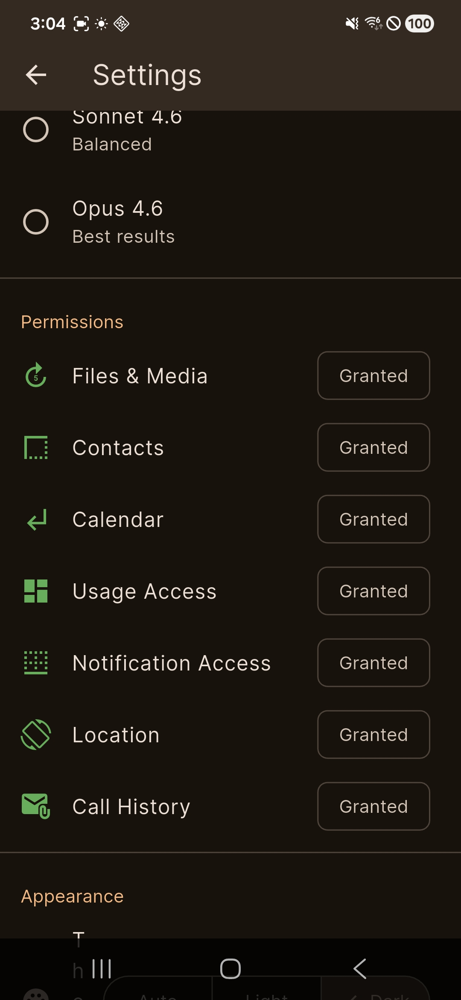

# Clawd Phone

Clawd Phone is an Android app built around native tool calling.

It brings the kind of agent workflow people usually use on desktop to Android, with the tool calling running natively on the phone. It can search, read files, search inside them, and use Android APIs directly.

There is no middle server. The app talks straight to the Anthropic endpoint. The only thing you need is your own Claude API key.

The app can inspect your device, and it can only create or edit
text files inside `Download/Clawd-Phone/` through the `FileWrite` and `FileEdit`
tools.

Conversations are saved locally and can be resumed later.

## Demo

<div align="center">
  <video src="https://github.com/user-attachments/assets/a83e1077-5445-4383-a9d8-afa5a4e89ae6" controls muted playsinline width="85%"></video>
</div>

<p align="center"><strong>Search across thousands of files on your phone</strong></p>
<p align="center"><sub>Video shown at 4x speed</sub></p>

<div align="center">
  <video src="https://github.com/user-attachments/assets/6e297561-96b4-4c02-bd15-a0b50a4de849" controls muted playsinline width="85%"></video>
</div>

## What you can do

Ask things like:
- "Find all PDFs on my phone"
- "Describe some photos I took last week"
- "What's using all my storage?"
- "Read this PDF and summarize it"
- "Write a detailed report about this PDF in `report.md`"
- "Create an HTML slide deck I can use like a PPT"
- "Make a `summary.csv` from these invoices"
- "Any tax related documents on this phone?"
- "Screen time report"
- "What are the latest world news?"

21 tools covering files, contacts, calendar, location, apps, device info, and web search.

## Models

Uses non-thinking Claude models. Pick one in Settings:

- **Haiku 4.5** — good for simple questions
- **Sonnet 4.6** — middle ground
- **Opus 4.6** — best results, use this for anything complex

## Setup

You need:
1. Flutter SDK (3.16+) — https://docs.flutter.dev/get-started/install
2. Android Studio — https://developer.android.com/studio
3. Anthropic API key — https://console.anthropic.com/settings/keys

```bash
flutter doctor   # check everything works
```

### Build it

```bash
cd clawd-phone

flutter pub get
```

### Run on a connected device

```bash
flutter run
```

### Build an APK

```bash
# Debug (larger, faster to build)
flutter build apk --debug

# Release (smaller, optimized)
flutter build apk --release --no-tree-shake-icons
```

APK will be at `build/app/outputs/flutter-apk/app-debug.apk` or `build/app/outputs/flutter-apk/clawd-phone-v1.0.0-release.apk`.

### Installing the APK

You can download the latest release APK from the GitHub Releases page, or install it over USB:

```bash
adb install build/app/outputs/flutter-apk/clawd-phone-v1.0.0-release.apk
```

## Permissions

| Permission | What it unlocks |
|---|---|
| All Files Access | File search, reading, PDFs, storage stats, `FileWrite`, `FileEdit` |
| Contacts | Contact search and details |
| Calendar | Calendar events |
| Location | GPS coordinates and address |
| Usage Access | Screen time, app usage |
| Notification Access | Read notifications |
| Call History | Call log |

## First launch

1. Open the app
2. Paste your Anthropic API key
3. Grant permissions in Settings (files, contacts, calendar, etc.)
4. Ask stuff



## Tools

`FileWrite` and `FileEdit` can only modify files
inside `Download/Clawd-Phone/`.

| Tool | Needs | What it does |
|------|-------|-------------|
| FileSearch | storage | Find files by name, type, size, date |
| FileRead | storage | Read text, images, PDFs, EPUBs, ZIPs |
| FileWrite | storage_full | Create or fully rewrite `.html`, `.md`, `.txt`, `.csv` in `Download/Clawd-Phone/` |
| FileEdit | storage_full | Exact text replacement inside `.html`, `.md`, `.txt`, `.csv` in `Download/Clawd-Phone/` |
| Metadata | storage | EXIF data, video info, audio tags |
| StorageStats | storage | Storage breakdown by type |
| DirectoryList | storage | List folder contents |
| FileContentSearch | storage | Search inside text files |
| RecentActivity | storage | Recently added/changed files |
| LargeFiles | storage | Biggest files on device |
| Contacts | contacts | Search and read contacts |
| Calendar | calendar | Read events |
| Location | location | Where you are |
| CallLog | call_log | Call history |
| Notifications | notifications | Current notifications |
| AppDetail | — | App info (last_used action needs usage_stats) |
| UsageStats | usage_stats | Screen time |
| DeviceInfo | — | Phone hardware/software info |
| Battery | — | Battery status |
| WebFetch | — | Fetch a web page |
| web_search | — | Anthropic server-side web search for current info |

## Workspace files

The app's writable workspace is:

```text
/storage/emulated/0/Download/Clawd-Phone
```

Only these formats are supported for write/edit and in-app preview:

- `.html`
- `.md`
- `.txt`
- `.csv`

### `FileWrite`

- Creates a new file inside `Download/Clawd-Phone/`

### `FileEdit`

- Edits an existing workspace file by exact string replacement
- Only works inside `Download/Clawd-Phone/`

### In-app preview

Successful `FileWrite` and `FileEdit` tool results show an `Open` action in the
chat UI. The app can preview:

- `.txt` as plain text
- `.md` as markdown
- `.csv` as a table, with raw-text fallback if parsing fails
- `.html` in an in-app web view

## How it works

```
Phone (Flutter + Kotlin)          Anthropic API
┌──────────────────────┐         ┌─────────────┐
│ You type a message   │────────>│ Claude reads │
│                      │         │ it, decides  │
│                      │<────────│ to call tools│
│ Tools run locally    │         │             │
│ (files, contacts...) │────────>│ Claude sees  │
│                      │         │ results,     │
│                      │<────────│ responds     │
│ You see the answer   │         │             │
└──────────────────────┘         └─────────────┘
```

No server in the middle.

## APK installation notes

If you install the APK manually, you may need to turn off Auto Blocker or a similar protection feature on your phone. Some phones flag manually installed apps that request broad file access. Clawd Phone needs that access for document search and for creating or editing files inside its workspace.

## License

MIT
